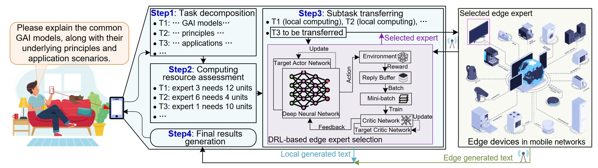
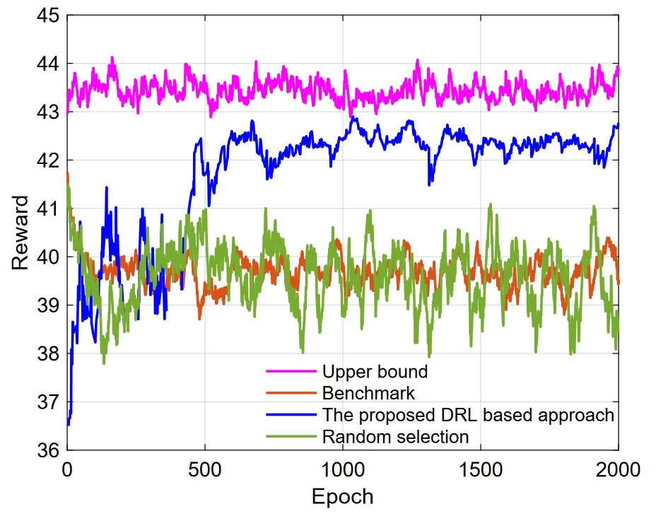
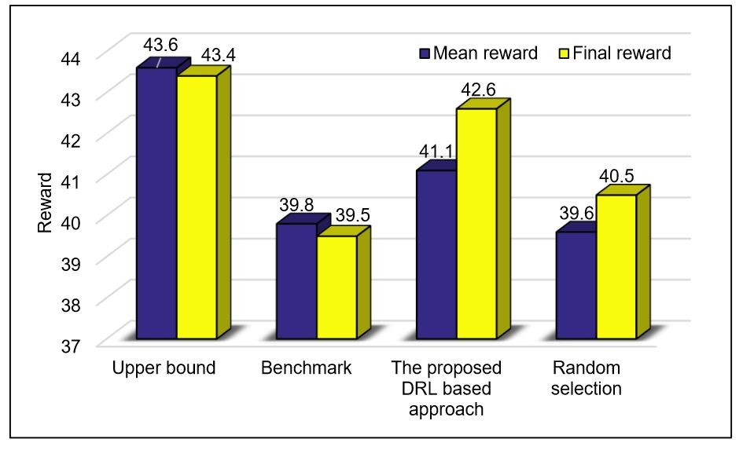

# [Net4MoE Project](https://hongyangdu.github.io/Net4MoE/)

This repository hosts a demonstration of the case study as presented in the paper

> **"Toward Scalable Generative AI via Mixture of Experts in Mobile Edge Networks" [Download Paper](https://arxiv.org/pdf/2402.09756.pdf)**



---

## 🔧 Environment Setup

To create a new conda environment, execute the following command:

```bash
conda create --name netmoe python==3.8
```
## ⚡Activate Environment

Activate the created environment with:

```bash
conda activate netmoe
```

## 📦 Install Required Packages

The following packages can be installed using pip:

```bash
pip install transformers
pip install gym
pip install torch
pip install numpy
pip install matplotlib
```

## 🔍 Step 1:
Call GPT API to build a gating network and several text generation experts who are good at generating text with different contents. The gate function can segment input prompts and selected the experts based on semantics, and can also fuse text segments based on semantics. https://platform.openai.com/docs/guides/text-generation

## 🔍 Step 2:
Using GPT API to evaluate the generated text and get the explicit score (https://arxiv.org/pdf/2304.00723.pdf ). 

The prompt here could be:
> Score the following story on a continual scale from 0 (worst) to 10 (best), where a score of 0 means "The story makes no sense and is totally not understandable" and a score of 10 means "The story is perfect-written and highly consistent ".

## 🔍 Step 3:
Input the prompt (a sentence) and use the gating network to split the prompt into several words and selected experts to generate the text based on these words.

## 🔍 Step 4:
Use the gating network to fuse the texts generated by different experts. The prompt could be:
> ‘Combine the following passages together to form a complete story’

## 🔍 Step 5:
Evaluate the text to get the scores. Taking three experts as an example, the explicit scores of the generated texts are given in the excel table. At the same time, the table also gives the word count of the generated texts, which corresponds to the transfer load of experts in the edge network.

## 🔍 Step 6:
Generate the SNR corresponding to each expert randomly, and calculate the computing and transmission cost (based on the Shannon Theory). The computing cost is the number of words in the generated text multiplied by a coefficient.

## 🔍 Step 7:
Train the DRL to select the suitable experts in the mobile edge network.





## 📚 Cite Our Work

Should our code assist in your research, please acknowledge our work by citing:

```bibtex
@article{du2024mixture,
  title={Mixture of Experts for Network Optimization: A Large Language Model-enabled Approach},
  author={Du, Hongyang and Liu, Guangyuan and Lin, Yijing and Niyato, Dusit and Kang, Jiawen and Xiong, Zehui and Kim, Dong In},
  journal={arXiv preprint arXiv:2402.09756},
  year={2024},
  month = {Feb.}
}
```
